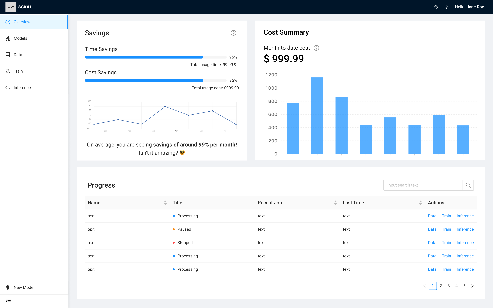
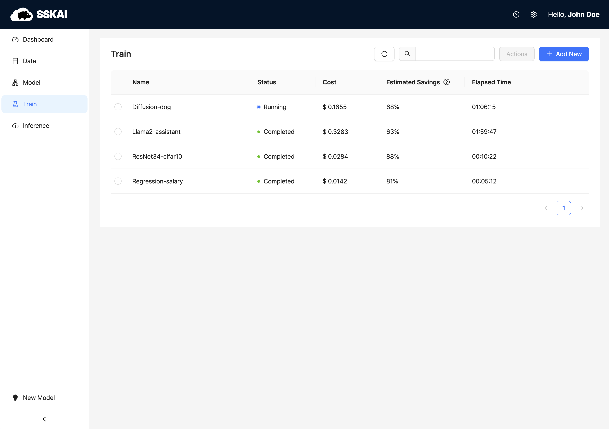

### 최적의 GenAIOps 환경을 제공하는 플랫폼

---
### 중간 발표 자료

<iframe src="https://docs.google.com/presentation/d/e/2PACX-1vT99WEy4Nt4D5rmQM1xj_0pN0unXcnF7Hd4eeBgMgB3yYG7RxPiEiOe_pNORc6N1Q/embed?start=false&loop=false&delayms=3000" frameborder="0" width="1920" height="1109" allowfullscreen="true" mozallowfullscreen="true" webkitallowfullscreen="true"></iframe>

### 중간 보고서

<iframe src="https://docs.google.com/document/d/e/2PACX-1vTk_gugjo6Kn975mTg9XLlMn2Dpp0LPXB85gjErZPZbkqU_GyHuFEugzOikWw4jJg/pub?embedded=true" width="1120" height="1500"></iframe>

---

### 산학 협력 기업
<a href="http://aws.amazon.com/what-is-cloud-computing"></a>

Amazon Web Service (AWS)는 컴퓨팅, 스토리지, 데이터베이스, 분석, 네트워킹, 모바일, 개발자 도구, 관리 도구, IoT, 보안 및 엔터프라이즈 애플리케이션을 비롯한 광범위한 글로벌 클라우드 기반 제품을 제공합니다.  온디맨드로 몇 초 만에 이용할 수 있으며 요금이 부과됩니다. pay-as-you-go 데이터 웨어하우징에서 배포 도구, 디렉터리, 콘텐츠 전송에 이르기까지 200개 AWS 이상의 서비스를 이용할 수 있습니다. 초기 고정 비용 없이 새 서비스를 신속하게 프로비저닝할 수 있습니다. 이를 통해 공공 부문의 기업, 신생 기업, 중소기업 및 고객이 변화하는 비즈니스 요구 사항에 신속하게 대응하는 데 필요한 구성 요소에 액세스할 수 있습니다.

---

### 1. 프로잭트 소개
Team SSKAI(Serverless Spot Kubernetes AI)는 최적의 클라우드 컴퓨팅 환경에서의 AI를 제공한다는 의미로 Sky에서 본따 지어졌습니다.

SSKAI에서 제작하는 `최적의 GenAIOps 환경을 제공하는 플랫폼`은 기존에 존재하는 MLOps/GenAIOps Solution의 단점과 불편한 점을 보완하여 사용자가 손쉽게 머신러닝 모델을 개발하고 배포할 수 있도록 하는 것을 목표로 합니다.

#### 주요 기능
1. 이용이 편리한 GenAIOps Pipeline 제공
    - 웹 서비스에 접근하여 학습용 데이터셋을 업로드하고, Foundation Model을 선택하거나 본인이 설계한 ML 모델을 업로드 하는 것을 통해 Fine-tuning, Training, Deploy, Monitoring을 손쉽게 이용할 수 있게 된다.
2. 최적의 비용 및 성능 인프라 제공
    - 모델의 크기, 연산자 수, 필요 성능 등을 종합적으로 판단하여 최적의 비용 및 성능을 가진 인프라를 통해 서비스를 제공한다.
    - 사용자는 이를 통해 90% 저렴한 비용으로 머신러닝 훈련을 작업하거나, 동일한 비용으로 최대 2배 가량 빠르게 작업을 완료할 수 있다.
3. 지속적 Monitoring 및 CI/CD 환경 제공
    - 훈련, Fine-tuning과 추론 서비스 배포로 운영 중 지속적인 Monitoring을 통해 사용자는 GenAIOps Workflow를 이용하여 CI/CD를 달성할 수 있다.
<!-- 
### 2. 소개 영상

추후 추가 예정. -->

### 2. 팀 소개

| 송무현 | 김규민 | 김유림 | 문지훈 | 박정명 | 정승우 |
|--------|--------|--------|--------|--------|--------|
|||||||
|20203085|20191555|20203043|20213347|20191598|20191664|
|mhsong@kookmin.ac.kr|okkimok123@kookmin.ac.kr|belbet01@kookmin.ac.kr|answlgns2056@kookmin.ac.kr|jmyeong012@kookmin.ac.kr|seungwoo1124@kookmin.ac.kr|
|팀장 및 진행 총괄, 추론 아키텍처 설계|분산 학습 아키텍처 설계|스팟 환경에서 안정성 있는 분산 학습 구현|기능 배포 자동화 구현|프론트엔드/백엔드|최적의 비용 아키텍처 선출 알고리즘 제작|
|[@mh3ong](https://github.com/mh3ong)|[@QueueMin](https://github.com/QueueMin)|[@Kim-Yul](https://github.com/Kim-Yul)|[@jhM00n](https://github.com/jhM00n)|[@j-myeong](https://github.com/j-myeong)|[@seungwoo1124](https://github.com/seungwoo1124)|


### 3. 배포 방법

사용자는 이 오픈 소스를 사용하여 본인의 클라우드 계정에 직접 플랫폼을 구축하여 최적의 가격의 머신러닝 환경을 사용할 수 있다.

클라우드 계정에 직접 배포하는 방법은 다음과 같다.

1. 필요 패키지 설치
    ```bash
    # macOS
    brew install terraform awscli
    # Linux (Ubuntu)
    sudo apt install terraform awscli -y
    # Linux (Redhat)
    sudo dnf install terraform awscli -y
    # Windows
    choco install terraform awscli
    ```
2. AWS 계정 권한 설정
    ```bash
    # aws configure 명령을 통해 Access Key, Secret Access Key를 지정한다.
    aws configure
    AWS Access Key ID [None]: AKIAIO**********
    AWS Secret Access Key [None]: wJalrXU**************
    Default region name [None]: ap-northeast-2
    Default output format [None]: json
    ```
3. Github Repository Clone 및 플랫폼 배포
    ```bash
    git clone https://github.com/kookmin-sw/capstone-2024-12.git
    cd ./capstone-2024-12
    terraform init
    # 약 15분 가량 소요됩니다.
    terraform apply --auto-approve
    # 배포 완료 후, Terraform output에 플랫폼에 접속할 수 있는 경로가 삭제됩니다.
    ```
4. 배포된 플랫폼 제거
    ```bash
    cd ./capstone-2024-12
    # 약 20분 가량 소요됩니다.
    terraform destroy --auto-approve
    ```

### 4. 사용법

사용자는 웹 브라우저를 통해 플랫폼에 접근할 수 있다.


